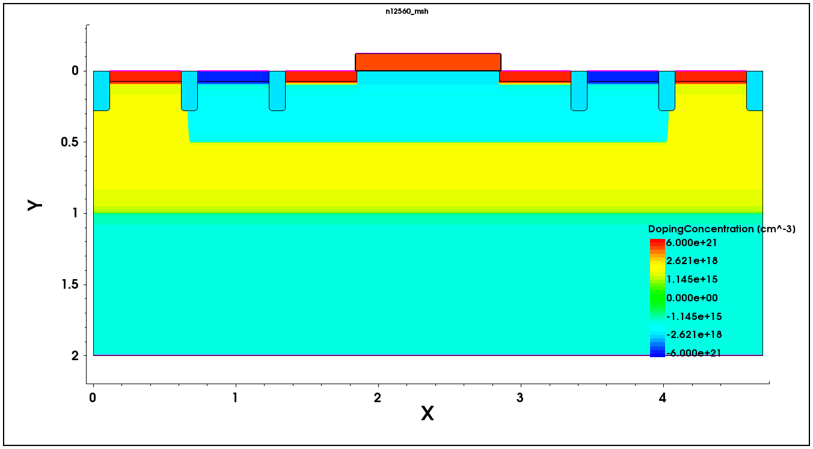

# 06 · Process Simulation with Sentaurus Process

This is the chapter where the Advanced level earns its name. Everything up to Level 2 draws
a device; process simulation *manufactures* one, and the difference changes how you think
about a specification.

## The shift in thinking

At Level 1 and 2, a doping profile is something you declare: a Gaussian of a given peak and
depth in a given box. It is exactly what you asked for, because you asked for it.

In `sprocess` you do not get to ask. You specify an implant — species, dose, energy, tilt,
rotation — and a thermal budget, and the junction depth is whatever the physics gives you.
If you anneal for longer, the junction moves. If you grow a screening oxide instead of
depositing one, the implant lands differently because the surface is no longer where it was.
If you etch a trench with sloped sidewalls, the subsequent implant shadows differently than
if the sidewalls were vertical.

That is the entire value proposition of process simulation: **it tells you things you did
not put in.** It is also why it is slow, and why choosing when to use it is an engineering
decision rather than a default.

## The flows I ran

| Flow | What it builds | Why it exists in the course |
| --- | --- | --- |
| **N-well diode** | An N-well/P-substrate junction diode with anode and cathode | The simplest complete process flow: well implant, anneal, contacts. Teaches the mechanics without the complexity. |
| **1D N-well profile** | A one-dimensional doping profile through the well | Isolates the implant-and-diffuse physics from geometry entirely, so you can see what a parameter does to a profile with nothing else in the way. |
| **28 nm NMOS (and capacitor variant)** | A full 28 nm-node NMOS with STI, wells, taps, halo, LDD, gate stack, source/drain | The real thing. Around thirty process steps, and the structure that the device, C-V and calibration work is built on. |

The 1D flow deserves a note, because its existence is a lesson in itself. When you want to
understand what implant energy does to a profile, simulating a full 2D structure with STI
and a gate stack is not just slower — it is *worse*, because everything else in the
structure is noise relative to the question. Reducing dimensionality until only the variable
of interest remains is a modelling skill, and the course teaches it by making you do the 1D
case first.

## The 28 nm NMOS flow, step by step

What follows is the logical sequence, with the reason each step exists. This is the shape of
a real CMOS front-end flow.

**1 · Initialise the substrate and set up the grid.** Define the silicon wafer, its
background doping and orientation, and establish the initial mesh with `refinebox`
declarations marking where fine grid will be needed later — under the gate, at the
junctions, across material interfaces. Declaring refinement *before* the features exist is
the correct order: the mesh must be ready when the physics arrives.

**2 · Load the calibrated model set.** `AdvancedCalibration` replaces raw model defaults
with Synopsys's calibrated coefficient set for diffusion, activation and damage. For any
work that will be compared against measured data this is effectively mandatory, and knowing
that the defaults are *not* the calibrated set is one of those facts that separates someone
who has run the tool from someone who has read about it.

**3 · Shallow trench isolation.** The first real geometry.

- Pad oxide and nitride hard mask.
- Trench etch — and specifically a **trapezoidal** etch, sloped rather than vertical,
  because that is what a real plasma etch produces and because sloped sidewalls fill without
  voids.
- Liner oxidation, then oxide fill.
- **CMP** to planarise back to the nitride, then nitride strip.

STI is why the flow is long, and it is also where meshing gets hard: the trench corner is a
geometric singularity with a field concentration at it, and it needs grid.

**4 · Well formation.** P-well for the NMOS, N-well where the complementary device and the
well taps go, each a multi-energy implant sequence — a deep implant for isolation and
punch-through control, a shallower one for the channel region — followed by a drive-in
anneal.

**5 · Threshold-adjust implant.** The Vt implant: a shallow, comparatively low-dose implant
whose whole purpose is to set the threshold voltage to specification. This is the most
direct link in the entire flow between a recipe number and a datasheet number, and the
course sweeps its peak doping, depth and position for exactly that reason.

**6 · Halo implant.** An angled, higher-dose implant local to the channel edges, placed to
raise the doping specifically where the source and drain depletion regions would otherwise
reach toward each other. It exists to fight short-channel effects — threshold roll-off,
punch-through, drain-induced barrier lowering — and at 28 nm it is not optional. The halo is
where implant *geometry* starts to matter as much as dose: tilt and rotation determine
whether the doping lands where the physics needs it.

**7 · Screening oxide — grown, not deposited.** Before the gate oxide, a thin screening
oxide. The flow **grows** it with `gas_flow` and `diffuse` rather than depositing it, which
matters: growth consumes silicon and moves the surface, so the silicon interface after
growth is not where it was before. Any subsequent implant depth is referenced to that new
surface. Deposition and growth are not interchangeable, and the difference shows up in the
electrical result.

**8 · Gate stack and patterning.** Gate dielectric, then polysilicon deposition, then
patterning the gate. The gate edge position defined here is what every subsequent
self-aligned step references, which is the elegance of a CMOS flow — the gate is its own
mask.

**9 · LDD / source-drain extension.** A shallow, moderate-dose implant self-aligned to the
gate, forming the lightly doped drain. Its job is to spread the peak electric field at the
drain edge so that hot-carrier damage and breakdown are pushed out — a deliberate trade of
some series resistance for reliability.

**10 · Spacers, then N+ / P+ source and drain.** Spacer formation offsets the heavy
implants from the gate edge, then the high-dose N+ (and P+ for the complementary device and
taps) implants form the low-resistance contact regions. The spacer width sets the offset,
and therefore the series resistance and the overlap capacitance — one geometric parameter
trading DC drive against switching speed.

**11 · Spike anneal.** A very short, very hot anneal: enough thermal budget to activate the
dopant, as little as possible so it does not diffuse. This is the clearest example in the
flow of a genuine physical trade-off with no free lunch — activation and diffusion are
driven by the same temperature, so the entire design of a spike anneal is about winning the
race between them.

**12 · Contacts, save, and output.** Define electrode contacts, `struct tdr` to write the
structure for the device simulator, and `WritePlx`/`SetPlxList` to write 1D profile cuts for
plotting.

## Techniques worth calling out

**Monte-Carlo implantation.** `sentaurus.mc` simulates individual ion trajectories
statistically rather than fitting an analytic profile. It costs real time but captures
channelling along crystal directions and lateral straggle — both of which matter for the
halo and LDD, where the profile's *tail* is the functional part. Choosing analytic for a
deep well implant and Monte-Carlo for a shallow angled one is a reasonable default.

**Four-rotation implants.** A tilted implant is asymmetric; performing it at 0°, 90°, 180°
and 270° with a quarter of the dose each restores symmetry. Real implanters rotate the wafer
for exactly this reason, and the deck mirrors the machine.

**Refinement and remeshing.** `refinebox` declares where grid is needed; `remesh` rebuilds
it after the structure changes. The important insight is that a mesh is only valid for the
geometry it was built for. Etch a trench and the pre-etch mesh is meaningless in that
region. Remeshing at structural transitions is not housekeeping — it is a correctness
requirement.

## What the result looks like

  

The 2D NMOS structure produced by this flow, plotted on signed doping concentration
(±6 × 10²¹ cm⁻³) across roughly 4.7 µm × 2 µm. Everything the flow built is visible: the two
**STI trenches** isolating the active area, the **P-well** beneath it, the **poly gate** on
its dielectric, the **source/drain** regions either side, and the **P-tap and N-tap**
contact regions at the edges that tie the well and substrate to defined potentials. This is
one node (`n12560`) of the process split tree.

> **Provenance.** This figure is an output shipped inside the course-supplied reference
> project (file date 2023-08-14), not one of my own captures. It is reproduced here because
> it is the clearest illustration of the flow described above. My own captures are in
> [`../screenshots/`](../screenshots/). See [`../PROVENANCE.md`](../PROVENANCE.md).

## My own process-simulation output

  
  

Left: several nodes of the N-well diode split arranged side by side in one Sentaurus Visual
session, so the effect of the process variation reads as a comparison rather than as a
sequence of separate plots. Right: the same structure with current density rendered as a
**vector field** rather than a magnitude contour — which answers a different question. A
contour tells you *how much* current density there is; a vector field tells you *where the
current goes*, and for a diode with a well and a substrate contact that path is the
interesting part.

Details and full-size images: [`../screenshots/01-process-simulation/`](../screenshots/01-process-simulation/).

## What went wrong, and what it taught me

Process simulation produced the most instructive failures of the whole level. Two examples,
covered fully in [11 · Debugging log](11-debugging-log.md):

**"Layout mask is not suitable for ion implantation. Please use a physical mask (such as
Photoresist)."** A layout mask is a geometric abstraction; an implant is a physical process
that interacts with a physical blocking layer of finite thickness and stopping power. The
tool is telling you that your model of masking is not physical enough for the step you asked
it to perform. Reading that warning properly is a small lesson in the difference between
drawing a device and building one.

**"Region sorting has ambiguity and may cause mismatched region names."** After enough
etching, depositing and CMP, the tool's automatic region naming can no longer be trusted to
be stable. This matters immediately downstream, because the device deck refers to regions
*by name*: an ambiguous name is a device simulation that silently applies physics to the
wrong region. It is the kind of warning that is easy to scroll past and expensive to ignore.

## When to use process simulation, and when not to

The judgement I came away with:

**Use it** when the process itself is the question — a new implant scheme, a thermal budget
change, an STI profile, anything where you need to know what the recipe will actually
produce. Also use it when you need a structure that is *credible* rather than merely
plausible, as the starting point for a calibration.

**Do not use it** when you have a working structure and the question is electrical. For the
mixed-mode inverter work I wanted to vary bias and circuit conditions, not the recipe;
re-running thirty process steps for every experiment would have bought nothing and cost
hours. Emulating the structure in `sde` was the right call.

Knowing which of those two situations you are in, before you start, is most of the skill.

---

**Next:** [07 · Structure, device and meshing](07-structure-device-and-meshing.md).
