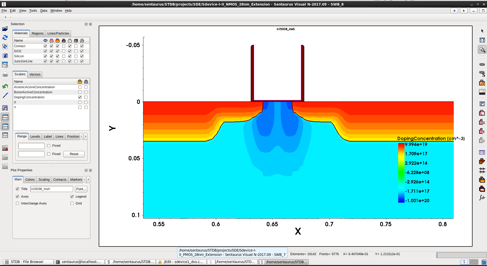
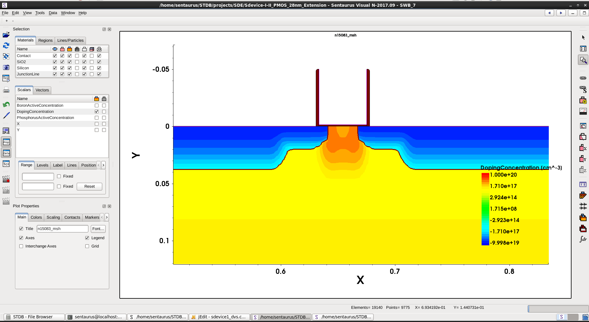
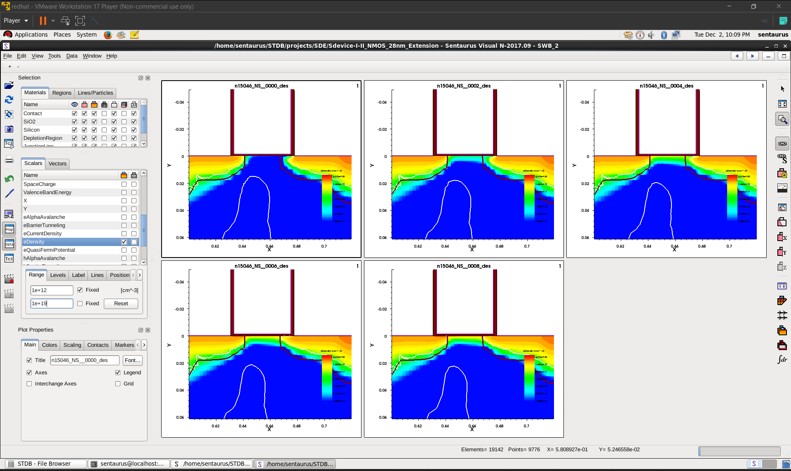
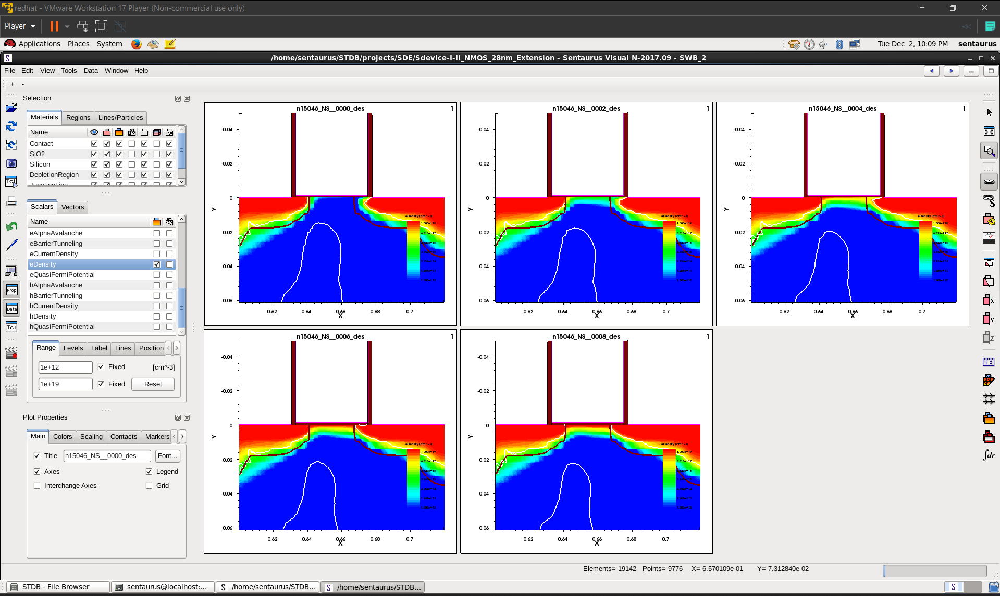
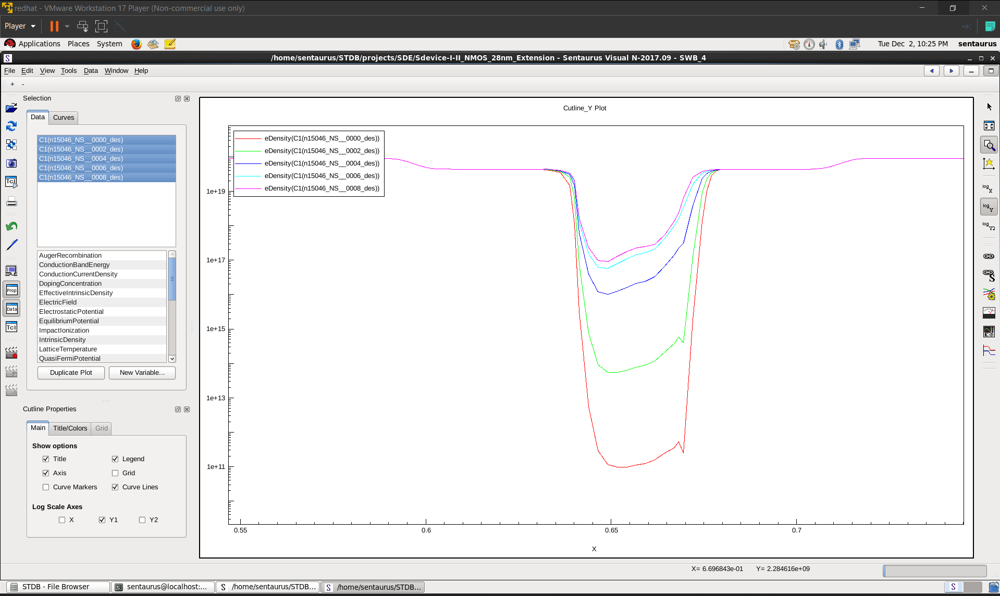

# 07 · Structure, Meshing and Device Simulation

Process simulation produces a structure. This chapter is about the other route to a
structure, the grid it has to live on, and the solver that turns it into current.

## Structure creation in `sde` — emulation as a deliberate choice

Sentaurus Structure Editor builds a device geometrically: regions with materials, contacts,
and doping profiles specified analytically or read in from a file. The command file is
**Scheme** (see [05 · Scripting](05-scripting-tcl-scheme-swb.md)).

The term the course uses for this is **emulation**, and it is a better word than
"approximation". You are not making a worse device — you are making a device whose
properties you control directly, which for many questions is exactly what you want.

The trade-off, stated plainly:

| | Process simulation (`sprocess`) | Emulation (`sde`) |
| --- | --- | --- |
| Doping profile | Emerges from implant + thermal physics | Specified analytically |
| Runtime | Minutes to hours per structure | Seconds |
| Answers | "What will this recipe produce?" | "How does this device behave?" |
| Change one doping parameter | Re-run the affected process steps | Edit one number |
| Fidelity to a real fab | High, if calibrated | As high as your profile description |

For the 28 nm NMOS/PMOS device work and the inverter, emulation was the right route: I
wanted to vary bias, circuit loading and model choices, and re-deriving the same structure
from thirty process steps each time would have been pure cost. For the STI and implant work
in [06 · Process simulation](06-process-simulation.md), process simulation was the only
route that answers the question. Being able to state which situation you are in is part of
what "simulation strategy" means in the Advanced curriculum.

What structure creation involves in practice: defining region boundaries and assigning
materials; placing **contacts** and naming them (these names become the `Electrode` entries
in the device deck, so a typo here surfaces as a confusing solver error later); specifying
doping — constant regions, analytic Gaussians and error-functions with peak, depth and
lateral extent, or profiles read from a process simulation; declaring mesh refinement; and
finally calling the mesher:

```scheme
(sde:build-mesh "snmesh" "-a -c conforming" "n@node@_msh")
```

## Meshing: where simulations are actually won or lost

The solver does not see your structure. It sees a finite-element mesh, and it solves the
semiconductor equations at the mesh nodes. Everything the mesh fails to resolve, the answer
does not contain.

**Why this is not a formality.** The quantities that matter vary over very different length
scales in different places. In the bulk, potential and carrier density change slowly over
microns. In the inversion layer under the gate oxide, electron density falls by orders of
magnitude within a few nanometres. Across a junction depletion region, the field goes from
zero to its peak and back over tens of nanometres. A uniform mesh fine enough for the
inversion layer would have millions of elements in the bulk where nothing is happening, and
would never finish; a uniform mesh coarse enough to finish would smear the inversion layer
into nonexistence and report the wrong drive current.

So meshing is resource allocation: spend elements where a gradient is steep, save them where
it is not.

**The controls I worked with:**

- **`refinebox`** — an explicit window with a specified element size. Used at junctions,
  under the gate, and around STI corners. The blunt instrument, and the one you reach for
  when you know where the physics is.
- **`MaxLenInt`** — maximum element length across a material interface. The Si/SiO₂
  interface is where the inversion layer lives and where surface mobility degradation and
  interface charge act; it needs resolution independently of anything else.
- **`DopingConcentration` / `MaxGradient` criteria** — let the mesher refine automatically
  wherever the doping profile is changing rapidly. This is the elegant version of the same
  idea: the doping profile already knows where the junctions are, so let it place the grid
  rather than doing it by hand. Especially valuable after process simulation, where you do
  not know in advance exactly where the junction ended up.
- **`MaxTransDiff`** — limits how fast element size may change between neighbours. Abrupt
  transitions from fine to coarse produce badly shaped elements, and badly shaped elements
  produce convergence failures that look like physics problems.
- **`remesh`** — rebuild the grid after the structure changes. A mesh is only valid for the
  geometry it was generated on.

**The rule I came away with:** refine on gradients, not on regions. And when a solve will
not converge, suspect the mesh before you suspect the physics — in my experience that is
where the problem was more often than not.

## Anatomy of an `sdevice` deck

Every device simulation is the same six blocks. Internalising this is what makes the tool
stop being opaque.

```
Electrode { … }   ← terminals: names, initial bias, workfunction
File      { … }   ← input grid; output plot, current and parameter files
Physics   { … }   ← which physical models apply
Plot      { … }   ← which internal quantities to save
Math      { … }   ← how to solve it numerically
Solve     { … }   ← in what order, through what bias/time schedule
```

**`Electrode`** — one entry per terminal, matching the contact names from the structure. For
a MOS gate this is also where **workfunction** is set, which directly shifts the threshold
voltage; parameterising it (`workfunction=@wfn@`) makes the gate material a variable of the
experiment rather than a constant.

**`File`** — the input `Grid`, and the outputs: `Plot` (the field data for `svisual`),
`Current` (the terminal I-V data, the `.plt` file), and `Param` (the parameter file
containing model coefficients). Naming these on the node number is what keeps a sweep's
results distinct.

**`Physics`** — the substantive block, discussed below.

**`Plot`** — the list of internal quantities written out per solution. Being generous here
costs disk and saves re-runs: `eDensity`, `hDensity`, `eCurrent`, `hCurrent`,
`ElectricField`, `eEnormal`, `eQuasiFermi`, `Potential`, `Doping`, `SpaceCharge`, `SRH`,
`Auger`, `AvalancheGeneration`, `eMobility`, `DonorConcentration`,
`AcceptorConcentration`, `eVelocity`. If you forget to plot a field and then want to look at
it, the only way to get it is to solve again.

**`Math`** — numerics: `Extrapolate` for a better initial guess at each bias step,
`RelErrControl` and `Digits` for the convergence criterion, `Iterations` and `Notdamped`
for Newton behaviour, `Method`/`SubMethod` for the linear solver, `Number_of_Threads` for
parallelism.

**`Solve`** — the schedule. Almost always: solve `Poisson` alone first to get a
self-consistent electrostatic starting point, then add the carrier continuity equations in a
`Coupled` block, then ramp bias in a `Quasistationary` sequence toward a `Goal`. Jumping
directly to the final bias from a cold start is the most reliable way to make a device
simulation fail.

## Physics model selection

This is the part that is engineering rather than operation. Each model you switch on is a
statement about your device, and the Advanced level's assessment leans on whether you can
justify them.

**Transport.** Drift-diffusion is the workhorse and was sufficient here. Added to it,
**`eQuantumPotential(density)`** applies a density-gradient quantum correction: in a 28 nm
device the inversion layer is thin enough that carriers are confined and the classical
density peak sits at the wrong place — right at the interface instead of a couple of
nanometres into the silicon. That displacement changes the effective oxide thickness and
therefore the gate capacitance, so it is a C-V-visible effect, not a cosmetic one.

**Mobility**, built up as a stack because each term corrects a different physical mechanism:

- `DopingDependence` — ionised impurity scattering. Heavier doping, lower mobility.
- `HighFieldSaturation(GradQuasiFermi)` — velocity saturation. At high longitudinal field
  carriers stop accelerating, which is why saturation current does not keep rising with
  drain bias. The `GradQuasiFermi` driving-force choice is the more physically defensible
  one for a MOSFET channel.
- `Enormal(IALMob)` — degradation from the *transverse* field pressing carriers against the
  oxide interface, where surface roughness and phonon scattering reduce mobility. In a MOSFET
  this is not a small correction; the channel is an interface device.
- `CarrierCarrierScattering` — matters at high injection.

**Recombination and generation:**

- `SRH(DopingDep)` — Shockley–Read–Hall trap-assisted recombination with doping-dependent
  lifetime. Dominates leakage in depletion regions.
- `Auger` — three-carrier recombination; matters at high carrier density.
- `Avalanche(UniBo2)` — impact ionisation, needed for breakdown, snapback and any ESD-type
  analysis.

**Band structure.** `BandGapNarrowing(OldSlotboom)` /
`EffectiveIntrinsicDensity(oldSlotboom)` — heavy doping narrows the bandgap and raises the
effective intrinsic density, which changes junction built-in potential and injection.
Skipping it in a device with 10²⁰-level source/drain doping is a real error.

**Thermal.** The `Thermodynamic` model solves lattice temperature alongside carrier
transport. Necessary whenever self-heating feeds back on the electrical behaviour — see
[09 · AC, transient and thermal](09-ac-transient-and-thermal.md).

**And the flag that keeps this honest:** `-CheckUndefinedModels`. If a model is invoked in a
material with no parameter set for it, `sdevice` substitutes silicon defaults and mentions it
only in the `.err` file. Silent substitution is worse than an error, because you get a plot
that looks fine. This bit me in the SiGe/Ge case documented in
[11 · Debugging log](11-debugging-log.md).

## Structures I worked with

<p align="center">
  <a href="../screenshots/02-device-structures/nmos-28nm-doping-concentration-structure.png">
    
  </a>
  <a href="../screenshots/02-device-structures/pmos-28nm-doping-concentration-structure.png">
    
  </a>
</p>

The 28 nm NMOS and PMOS, plotted on signed doping concentration. Plotting both on the same
scale is deliberate: the visible asymmetry between them is the physical reason a CMOS
inverter needs a wider PMOS, and it is why the inverter deck uses `AreaFactor=10` on the
NMOS and `AreaFactor=20` on the PMOS. Hole mobility is roughly half electron mobility, so
equal drive strength requires unequal width — an abstract fact until you have the two
structures side by side.

## Device analysis under bias

<p align="center">
  <a href="../screenshots/03-device-simulation/nmos-28nm-edensity-gate-bias-sweep.png">
    
  </a>
  <a href="../screenshots/03-device-simulation/nmos-28nm-edensity-fixed-colour-range.png">
    
  </a>
  <a href="../screenshots/03-device-simulation/nmos-28nm-edensity-vertical-cutline-log.png">
    
  </a>
</p>

Three things I want to point at in these, because they are analysis decisions rather than
button presses.

**Electron density across a gate-bias sweep** (left) shows the inversion layer forming: at
low V<sub>g</sub> the channel region is depleted, and as V<sub>g</sub> passes threshold a
dense sheet of electrons appears at the oxide interface connecting source to drain. This is
the definition of a MOSFET turning on, seen directly rather than inferred from a curve.

**The same sweep with the colour range pinned** (centre) is the one that matters
methodologically. Sentaurus Visual auto-scales each plot to its own data range by default —
which means every panel in a sweep looks *identical*, because each is normalised to its own
maximum. The comparison is worthless until you fix the range across all panels. This is a
general trap in scientific visualisation and it is worth having been caught by it once.

**A vertical cutline on a log axis** (right) turns the 2D field into a 1D profile from the
oxide down into the substrate. On a log scale you can read the inversion layer peak, its
depth below the interface, the fall-off into the depletion region and the bulk level — five
orders of magnitude that a linear colour map cannot show. Field plots are for locating
things; cutlines are for measuring them.

A fourth capture in that folder shows **conduction current density** over the same sweep,
which is the complementary view: carrier density tells you where the carriers are, current
density tells you where they are going.

Per-image notes: [`../screenshots/03-device-simulation/`](../screenshots/03-device-simulation/).

## Convergence, practically

What actually makes a device simulation converge, learned mostly by it not converging:

**Ramp, do not jump.** `Quasistationary` with a sensible `InitialStep`, a modest
`Increment` and a `MinStep` floor. Each bias point starts from the previous solution, so
small steps mean good initial guesses.

**Solve Poisson first.** A self-consistent electrostatic solution is a far better starting
point for the coupled system than a cold start.

**Pick the right linear solver.** `ILS` (iterative) for large problems; `Method=Blocked` with
`SubMethod=ParDiSo` for multi-device systems where the block structure of the Jacobian can be
exploited. See [08 · Mixed-mode](08-mixed-mode-simulation.md).

**Read non-convergence as information.** A solve that stalls at a particular bias is usually
telling you about a mesh deficiency in a region that has just become important, or about a
bias schedule that is stepping too aggressively into a region of strong nonlinearity. It is
rarely random.

---

**Next:** [08 · Mixed-mode simulation](08-mixed-mode-simulation.md) —
a CMOS inverter with two real devices in it.
