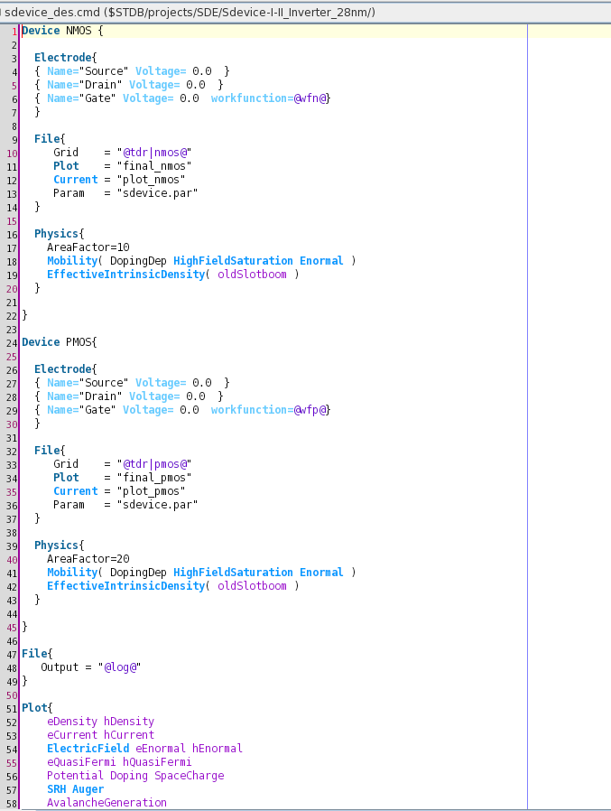
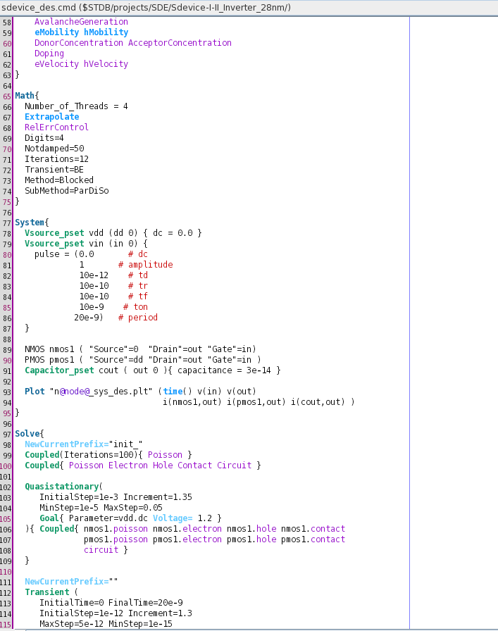
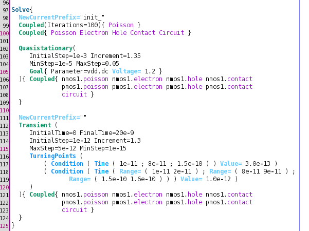

# 08 · Mixed-Mode Simulation — A CMOS Inverter

This is the piece of Advanced-level work I would open with in an interview, because it is
where device physics and circuit behaviour stop being separate subjects.

## What mixed-mode means

An ordinary device simulation solves one device with fixed voltages on its terminals. A
SPICE simulation solves a circuit of compact models — equations fitted to devices, not
devices. **Mixed-mode** solves the real thing: two or more physically meshed devices, each
with its full drift-diffusion physics, wired into a netlist with lumped sources and passives,
with the device equations and the circuit equations solved *simultaneously* in one Newton
system.

Why that matters: in a compact model, the transistor's response to its terminal voltages is a
fitted formula. In mixed-mode, the transistor's response is computed from the carrier
transport inside it — so effects that no compact model was fitted for still appear. If the
output node's voltage depends on the drain current, and the drain current depends on the
internal field distribution, and that depends on the output node's voltage, mixed-mode
resolves that loop self-consistently at every timestep. This is how you simulate an ESD event
through a protection device, or a switching transient where the device leaves its
well-characterised operating region.

The cost is severe — you are solving two full device meshes plus a circuit, at every
timestep — which is why you do it for the one node in your circuit that actually needs it.

## The circuit

```
                 VDD (ramped 0 → 1.2 V)
                      │
                  ┌───┴───┐
        in ───────┤  PMOS │  AreaFactor = 20
                  └───┬───┘
                      ├──────────── out ────┬─── C_load = 30 fF
                  ┌───┴───┐                 │
        in ───────┤  NMOS │  AreaFactor = 10│
                  └───┬───┘                 │
                      │                     │
                     GND ──────────────────┘

        in = pulse source, 0 → 1 V, period 20 ns
```

A textbook inverter — except that the two transistors are the meshed 28 nm NMOS and PMOS
structures from [07 · Structure, meshing and device simulation](07-structure-device-and-meshing.md),
not models of them.

## The deck, walked through

> **Provenance.** The command file excerpted here is the course-supplied
> `sdevice_des.cmd` from the `Sdevice-I-II_Inverter_28nm` project
> (`$STDB/projects/SDE/`). The commentary is mine, and the three screenshots are captures of
> my own editor session in that project. See [`../PROVENANCE.md`](../PROVENANCE.md).

### Device declarations

```tcl
Device NMOS {
  Electrode{
    { Name="Source" Voltage=0.0 }
    { Name="Drain"  Voltage=0.0 }
    { Name="Gate"   Voltage=0.0 workfunction=@wfn@ }
  }
  File{ Grid="@tdr|nmos@"  Plot="final_nmos"  Current="plot_nmos"  Param="sdevice.par" }
  Physics{ AreaFactor=10
    Mobility( DopingDep HighFieldSaturation Enormal )
    EffectiveIntrinsicDensity( oldSlotboom ) }
}
```

`Device NMOS { … }` declares a device *type*, not yet an instance — the distinction matters
because the netlist later instantiates it. Four things in this block are worth noticing.

**`Grid="@tdr|nmos@"`** pulls the structure from the `nmos` branch of the Workbench split
tree. The device is not defined here; it is imported, which is what keeps structure work and
circuit work separate.

**`workfunction=@wfn@`** parameterises the gate workfunction, so gate material becomes a
variable of the experiment. Since workfunction shifts threshold voltage directly, this is the
knob that sets where the inverter switches.

**`AreaFactor`** is how a 2D simulation represents a 3D device: the 2D cross-section is
scaled by an effective width. **`AreaFactor=10` for the NMOS and `20` for the PMOS** is the
inverter's central design decision expressed in one number each. Hole mobility in silicon is
roughly half electron mobility, so a PMOS of equal width drives roughly half the current;
making it twice as wide equalises the pull-up and pull-down strength and gives a symmetric
transition. This is the classic 2:1 CMOS sizing ratio, and here it is a simulation parameter
rather than a rule of thumb.

**The `Physics` block is per device.** Each device gets `Mobility(DopingDep
HighFieldSaturation Enormal)` and `EffectiveIntrinsicDensity(oldSlotboom)` — doping-dependent
mobility, velocity saturation, transverse-field surface degradation, and bandgap narrowing.
That they are declared separately means NMOS and PMOS could carry different physics if the
question required it.

The PMOS block is the mirror image, with `workfunction=@wfp@` and `AreaFactor=20`.

<p align="center">
  <a href="../screenshots/04-mixed-mode-cmos-inverter/sdevice-inverter-nmos-pmos-device-blocks.png">
    
  </a>
</p>

### Numerics

```tcl
Math{ Number_of_Threads = 4  Extrapolate  RelErrControl  Digits=4
      Notdamped=50  Iterations=12  Transient=BE
      Method=Blocked  SubMethod=ParDiSo }
```

**`Method=Blocked` with `SubMethod=ParDiSo`** is the setting that makes this tractable. The
Jacobian of a two-device-plus-circuit system is naturally block-structured: a block per
device, plus circuit coupling. A blocked method exploits that structure instead of treating
the whole thing as one dense problem, and `ParDiSo` is the parallel direct sparse solver used
within each block. Choosing the solver to match the structure of the problem is a
transferable numerical-methods idea, and this is the clearest example of it I met in the
course.

**`Transient=BE`** selects backward Euler for time integration — first-order and implicit,
so unconditionally stable and forgiving of stiff behaviour, at the cost of numerical damping.
For switching transients where robustness matters more than the last decimal place, that is
the right trade.

**`Extrapolate`** uses the previous solutions to guess the next one, which for a smoothly
varying sweep dramatically reduces Newton iterations. **`Notdamped=50`** allows fifty
iterations before damping kicks in, and **`Digits=4`** with **`RelErrControl`** sets the
convergence criterion on relative error.

### The netlist

```tcl
System{
  Vsource_pset vdd (dd 0) { dc = 0.0 }
  Vsource_pset vin (in 0) {
    pulse = (0.0        # dc offset
             1          # amplitude
             10e-12     # delay
             10e-10     # rise time
             10e-10     # fall time
             10e-9      # on time
             20e-9)     # period
  }
  NMOS nmos1 ( "Source"=0  "Drain"=out "Gate"=in )
  PMOS pmos1 ( "Source"=dd "Drain"=out "Gate"=in )
  Capacitor_pset cout ( out 0 ) { capacitance = 3e-14 }
  Plot "n@node@_sys_des.plt" ( time() v(in) v(out)
        i(nmos1,out) i(pmos1,out) i(cout,out) )
}
```

The `System` block is a netlist in the SPICE sense: elements, and nodes that connect them.
`0` is ground; `dd`, `in` and `out` are named nodes.

**`NMOS nmos1 (...)`** instantiates the device type declared earlier and maps its *electrode
names* to *circuit nodes*. Both gates tie to `in`, both drains to `out`, NMOS source to
ground, PMOS source to `dd` — the inverter, wired. The mapping from electrode name to node is
where the structure's contact names from `sde` finally get used, which is why a naming
mistake three tools upstream surfaces here.

**The pulse source** is 0 → 1 V with 10 ps delay, 1 ns rise and fall, 10 ns on-time and 20 ns
period: one full cycle in the 20 ns simulation window. Worth noting honestly that the input
swings to 1 V while the supply is ramped to 1.2 V, so the input does not quite reach the rail
— the NMOS gate overdrive is 1 V rather than 1.2 V. That is a property of the deck as
supplied, not an error, but it is the kind of detail worth spotting rather than assuming
symmetry.

**`Capacitor_pset cout … 3e-14`** is a 30 fF load. Without a load, the output node has only
the devices' own parasitics and the transient is dominated by numerical rather than physical
timescales. The load capacitor is what makes the switching time mean something: it is the
next stage's input capacitance plus wiring, and the RC of (device on-resistance × 30 fF) is
essentially the propagation delay this simulation measures.

**The `Plot` line** is what makes the result analysable. Saving `v(in)` and `v(out)` gives
the transfer behaviour; saving `i(nmos1,out)`, `i(pmos1,out)` and `i(cout,out)` separately
gives current *decomposed by path*, which is the interesting part. During a transition both
transistors conduct briefly and there is a direct supply-to-ground current — short-circuit
current — distinct from the current charging the load. Having the three currents separately
means you can see that happen rather than infer it.

<p align="center">
  <a href="../screenshots/04-mixed-mode-cmos-inverter/sdevice-inverter-math-system-netlist.png">
    
  </a>
</p>

### The solve schedule

```tcl
Solve{
  NewCurrentPrefix="init_"
  Coupled(Iterations=100){ Poisson }
  Coupled{ Poisson Electron Hole Contact Circuit }

  Quasistationary( InitialStep=1e-3 Increment=1.35
                   MinStep=1e-5 MaxStep=0.05
    Goal{ Parameter=vdd.dc Voltage=1.2 }
  ){ Coupled{ nmos1.poisson nmos1.electron nmos1.hole nmos1.contact
              pmos1.poisson pmos1.electron pmos1.hole pmos1.contact  circuit } }

  NewCurrentPrefix=""
  Transient( InitialTime=0 FinalTime=20e-9
             InitialStep=1e-12 Increment=1.3
             MaxStep=5e-12 MinStep=1e-15
    TurningPoints (
      ( Condition ( Time ( 1e-11 ; 8e-11 ; 1.5e-10 ) ) Value= 3.0e-13 )
      ( Condition ( Time ( Range=( 1e-11 2e-11 ) ; Range=( 8e-11 9e-11 ) ;
                           Range=( 1.5e-10 1.6e-10 ) ) ) Value= 1.0e-12 ) )
  ){ Coupled{ nmos1.poisson nmos1.electron nmos1.hole nmos1.contact
              pmos1.poisson pmos1.electron pmos1.hole pmos1.contact  circuit } }
}
```

This is a four-stage schedule, and the staging *is* the engineering.

**Stage 1 — Poisson only.** `Coupled(Iterations=100){ Poisson }` gets a self-consistent
electrostatic solution with no transport. Cheap, robust, and a far better starting point than
zero.

**Stage 2 — add transport and the circuit.**
`Coupled{ Poisson Electron Hole Contact Circuit }` brings in the carrier continuity
equations, the contact conditions and the circuit equations. Note `Circuit` appearing inside
the coupled block: the netlist is not solved separately and then applied, it is part of the
same Newton system. That is the definition of mixed-mode.

**Stage 3 — ramp the supply.** `Quasistationary` walks `vdd.dc` from 0 to 1.2 V in adaptive
steps (`InitialStep=1e-3`, growing by ×1.35 up to `MaxStep=0.05`, with a `MinStep` floor for
retries). This establishes a valid DC operating point before any time-dependent behaviour is
asked for. Notice also that from here on the coupled block is written per instance —
`nmos1.poisson`, `pmos1.electron` and so on — so the solver is told explicitly which
equations belong to which device.

**`NewCurrentPrefix`** is a small piece of good practice: the initialisation and ramp write
their current data under an `init_` prefix, so the startup transient does not contaminate the
data file that holds the actual measurement.

**Stage 4 — the transient, with `TurningPoints`.** The simulation runs 0 → 20 ns with an
adaptive timestep from 1 fs to 5 ps. `TurningPoints` is the sophisticated part: it forces the
timestep down to specified values at specified instants and over specified ranges. Here the
step is tightened to 0.3 ps at three instants and to 1 ps across three short windows, all of
which fall inside the input's rising edge — precisely where the output slews, both devices
conduct simultaneously, and the solution is changing fastest.

The idea generalises. An adaptive timestep controller reacts to change *after* detecting it,
which means it can walk straight past a fast event with a step that was appropriate a moment
ago. `TurningPoints` lets you say "I know the interesting thing happens here, spend
resolution here" — using your knowledge of the stimulus to guide the numerics, instead of
either globally reducing the step (wasting effort across 20 ns of nothing happening) or
hoping the controller notices in time.

<p align="center">
  <a href="../screenshots/04-mixed-mode-cmos-inverter/sdevice-inverter-solve-transient-turningpoints.png">
    
  </a>
</p>

## What this simulation actually tells you

The output is `v(out)` against time, plus the three decomposed currents, and from it you can
read: the **propagation delay** and **rise/fall times** driving 30 fF; the **short-circuit
current** spike when both devices conduct during the transition; the **switching threshold**,
i.e. the input voltage at which the output crosses mid-rail, and hence whether the 2:1 sizing
actually delivered a symmetric transition; the **dynamic energy** per transition from the
integral of the load current; and — because these are real meshed devices — what the internal
carrier and field distributions look like *at any instant during switching*, which a compact
model cannot give you at all.

That last point is the reason for the whole exercise. A SPICE simulation of an inverter takes
milliseconds and tells you the delay. Mixed-mode takes hours and tells you the delay *and*
lets you look inside the transistor at the moment it happens.

## What I took away

**Circuit and device are one system.** Not "device physics informs circuit design" as a
slogan — literally one Jacobian, solved together.

**`AreaFactor` is where 2D meets reality.** A 2D simulation has no width; `AreaFactor`
supplies it, and the NMOS/PMOS ratio encodes the mobility asymmetry that dictates CMOS
sizing.

**Staged solving is not optional.** Poisson, then coupled transport, then DC ramp, then
transient. Every stage exists because the next one needs a good starting point.

**Match the solver to the structure of the problem.** Blocked methods for block-structured
systems.

**Put the timesteps where the physics is.** `TurningPoints` is the clearest example I have
met of using domain knowledge to make a numerical method affordable.

---

**Next:** [09 · AC, transient and thermal analysis](09-ac-transient-and-thermal.md).
