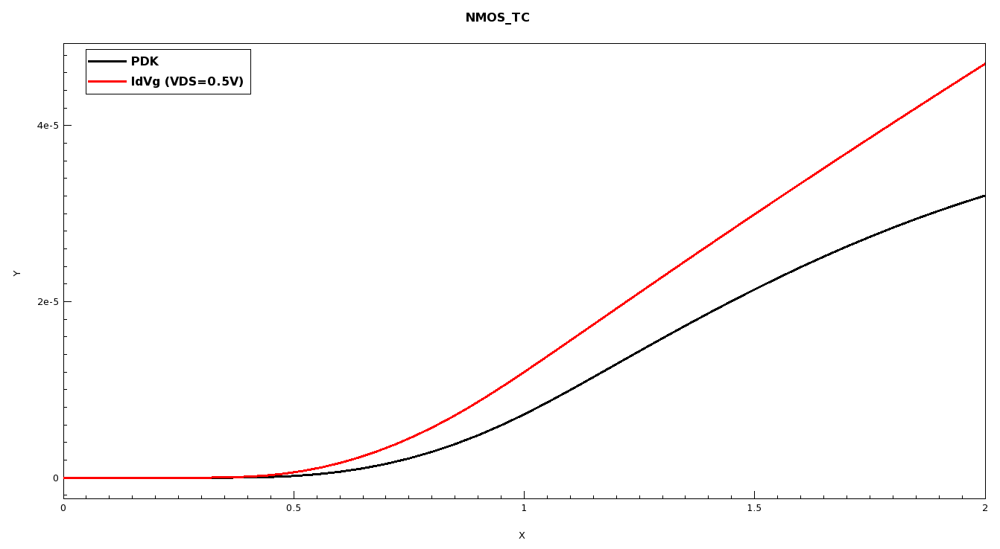
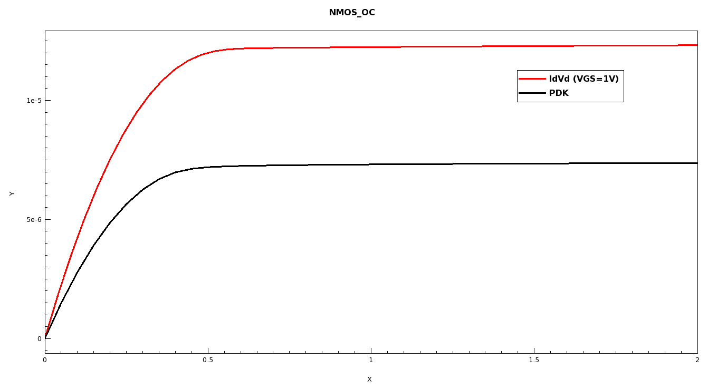
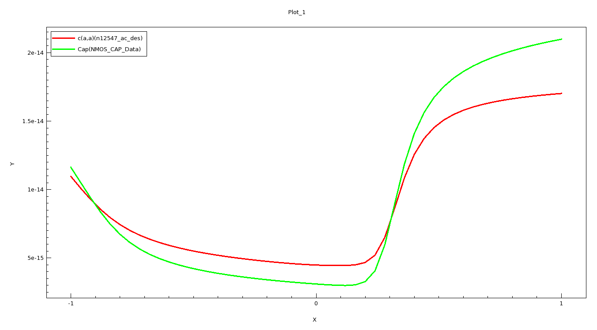

# 10 · Calibration and Parameter Extraction

A simulation that has not been compared against data is a hypothesis with a colour map
attached. This chapter is about the two activities that turn it into engineering: pulling
numbers out of simulated curves, and checking those curves against reality.

## Parameter extraction

**The idea.** A field plot is qualitative. A curve is better. A *number* is what goes into a
specification, a comparison, or a design decision. Extraction is the step that reduces a
simulated characteristic to the figures of merit someone will actually quote:

| Parameter | Where it comes from |
| --- | --- |
| Threshold voltage V<sub>th</sub> | I<sub>d</sub>-V<sub>g</sub>, by constant-current or linear extrapolation |
| On-resistance R<sub>on</sub> | Slope of I<sub>d</sub>-V<sub>d</sub> in the linear region |
| Saturation current I<sub>dsat</sub> | I<sub>d</sub>-V<sub>d</sub> plateau at specified V<sub>gs</sub> |
| Subthreshold slope | Slope of log I<sub>d</sub> vs V<sub>g</sub> below threshold |
| Oxide capacitance C<sub>ox</sub> | C-V accumulation plateau |
| Substrate doping | C-V depletion slope |

**Doing it in `svisual` rather than by hand.** Sentaurus Visual's `extract` library provides
these as callable procedures, so extraction happens inside the flow. The R<sub>on</sub> case,
which is the one I worked through:

```tcl
load_library extract
set Vds [get_variable_data "Drain OuterVoltage" -dataset PLT_IdVd($N)]
set Ids [get_variable_data "Drain TotalCurrent"  -dataset PLT_IdVd($N)]

set Vo 0.3
ext::ExtractRdiff out= Ron name= "Ron" v= $Vds i= $Ids vo= $Vo
echo "Ron (Vd = $Vo V) is [format %.3f $Ron] Ohm"
```

> **Provenance.** Excerpt from the course-supplied `svisual_vis.tcl` in the
> `Sdevice-I-II_NMOS_28nm_AC_Simulation` project; annotation mine. See
> [`../PROVENANCE.md`](../PROVENANCE.md).

Two details in that short block are the actual content.

**`ExtractRdiff` computes *differential* resistance** — dV/dI at the operating point — not
V/I. For a nonlinear device those are different numbers, and the differential one is what a
circuit designer needs, because it describes the device's response to a small change about its
bias point.

**The operating point is specified, and the choice is physical.** `vo = 0.3` V evaluates
R<sub>on</sub> at V<sub>d</sub> = 0.3 V, in the **linear region**, where the channel is a
resistor and R<sub>on</sub> has a meaning. Evaluate it in saturation and you get a large
number that describes output resistance, not on-resistance. An extraction is only as
meaningful as the operating point you evaluate it at, and quoting R<sub>on</sub> without
saying at what bias is a genuinely uninformative statement.

**Why scripting it matters.** With a sweep of a dozen nodes, extraction-by-cursor is a dozen
manual measurements you will redo every time a process parameter changes. Scripted, R<sub>on</sub>
comes out of every node automatically, into the log, next to the curve it came from. The
result is reproducible by anyone who can read the script — which is the difference between a
number and a claim.

## Calibration

**What it means.** Adjusting model parameters so that simulated characteristics match measured
data from real fabricated devices — here, reference data from a **PDK** (Process Design Kit),
the silicon-verified model set a foundry provides for its process. Once calibrated, the
simulation can be trusted to *predict*: to explore process variations that have not been
fabricated, which is the entire economic argument for TCAD.

**Why it is the endpoint of the course.** Every earlier skill exists to serve it. You need a
credible structure (process simulation), a mesh that resolves the physics (meshing), a
justified model set (device physics), a converged solution (numerics) and extracted numbers
(post-processing) — and only then can you say anything meaningful about whether your
simulation matches silicon.

## The three comparisons

The Advanced material calibrates against three independent measurements, which is the
methodologically important part: matching one curve is easy, matching three with the same
parameter set is a real constraint.

> **Provenance.** The three figures below are outputs shipped inside the course-supplied
> reference project (file dates 2023-08-14), not my own captures. They are reproduced because
> they are the clearest available illustration of the calibration exercise, and my reading of
> them is my own. My own captures are in [`../screenshots/`](../screenshots/).

### Transfer characteristic — I<sub>d</sub> vs V<sub>g</sub>

<p align="center">
  <a href="../reference/nmos-28nm-transfer-characteristic-vs-pdk.png">
    
  </a>
</p>

Simulated `IdVg` at V<sub>DS</sub> = 0.5 V against the PDK reference, over V<sub>g</sub> = 0
to 2 V. The shapes agree — turn-on happens at essentially the same gate voltage, so the
threshold is close — but the **simulated current runs above the reference** across the whole
above-threshold range, reaching roughly 5 × 10⁻⁵ A where the PDK sits lower.

That specific signature is informative. Threshold matching with an over-predicted drive
current points away from the electrostatics (oxide thickness and channel doping are
approximately right, or V<sub>th</sub> would be displaced) and toward the **transport and
resistance** side: mobility set too high, velocity saturation under-weighted, effective channel
length too long, or — the usual first suspect — **series resistance not adequately represented**.
Source/drain and contact resistance drop voltage that never reaches the channel, and a
simulation that omits them delivers the full applied bias to the channel and therefore too
much current. Reading a discrepancy as a *diagnosis* rather than as a failure is the skill
this figure teaches.

### Output characteristic — I<sub>d</sub> vs V<sub>d</sub>

<p align="center">
  <a href="../reference/nmos-28nm-output-characteristic-vs-pdk.png">
    
  </a>
</p>

Simulated `IdVd` at V<sub>GS</sub> = 1 V against the PDK. Same story, quantified: the
simulation saturates near **1.25 × 10⁻⁵ A** where the reference saturates near
**7.3 × 10⁻⁶ A** — over-prediction by a factor of roughly 1.7.

Both figures over-predicting by a similar factor is itself a useful signal: a consistent
multiplicative error across two different sweeps suggests one systematic cause rather than
several independent ones. Series resistance and mobility are both consistent with that, and
the way to separate them is that series resistance costs you more at high current — so the
error should grow with drive if resistance is the cause, and stay proportional if mobility is.
Which is precisely why you look at both curves rather than one.

### Capacitance–voltage

<p align="center">
  <a href="../reference/nmos-28nm-cv-simulated-vs-reference.png">
    
  </a>
</p>

Simulated small-signal capacitance from the AC node (`c(a,a)` from `n12547_ac_des`) against
reference capacitance data, from −1 V to +1 V, spanning roughly 3 × 10⁻¹⁵ F to
2.1 × 10⁻¹⁴ F. Here the agreement is close over the full bias range, which is the
encouraging part of the exercise and tells you something specific: capacitance is set
primarily by oxide thickness and by how charge distributes under the gate, so a good C-V match
says the **structure and electrostatics are right**.

Taken with the two I-V figures, the diagnosis sharpens considerably. Electrostatics correct
(C-V matches), threshold correct (turn-on aligns), current over-predicted (both I-V curves
high) — that combination points at transport and resistance, not at geometry or doping. This
is what having three independent measurements buys you: not just a better fit, but the ability
to localise the error.

## The calibration loop

The method, stated as I would defend it in a viva:

1. **Get a credible structure first.** Calibrating model parameters to compensate for a wrong
   geometry produces a set of numbers that fit one device and predict nothing. This is the
   cardinal sin of calibration.
2. **Match electrostatics before transport.** C-V and threshold first. If the charge is in the
   wrong place, no mobility parameter will save you.
3. **Then match current.** Mobility, velocity saturation, series resistance.
4. **Change one parameter at a time, and know what it does.** The parameter space is large and
   many combinations fit one curve. Understanding *which* parameter has *which* signature is
   the whole skill — the Advanced curriculum's phrase for this is identifying the "critical
   model parameters."
5. **Identify the operating regime you care about.** A device calibrated in saturation may be
   poor in subthreshold. Ask what the model is *for* before deciding it is good enough.
6. **Validate on data you did not fit.** Fit the transfer characteristic, then check the
   output characteristic. If it also improves, the parameters are physical. If it degrades, you
   have curve-fitted rather than calibrated.
7. **Never fit outside physical bounds.** A mobility parameter tuned beyond its physically
   sensible range will produce a good-looking plot and a model that fails the moment it is
   extrapolated — which is the only thing you actually wanted it for.

## Why this is the most transferable chapter

Everything above is model validation, and model validation is the same discipline everywhere:
distinguish a systematic error from a random one, use independent measurements to localise the
cause, change one variable at a time, hold parameters inside physically defensible bounds, and
validate on held-out data. Substitute "training set" for "transfer characteristic" and this is
a machine-learning methodology section; substitute "wind tunnel data" and it is aerodynamics.

Which is why the discrepancy in the two I-V figures is, in my view, the most valuable thing in
this repository. A perfect match teaches you nothing. A 1.7× over-prediction, with a matching
C-V and an aligned threshold, teaches you how to reason about *why* — and that reasoning is
the skill.

---

**Next:** [11 · Debugging log](11-debugging-log.md) — the errors, and what each one meant.
