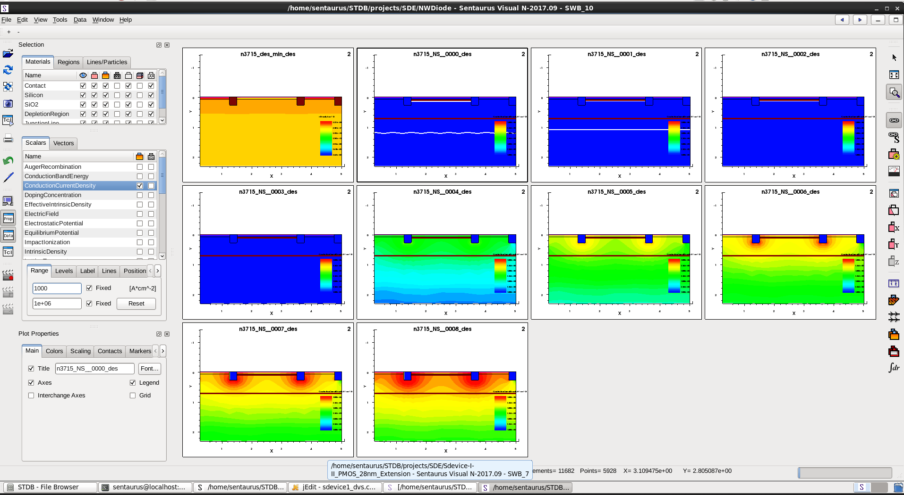
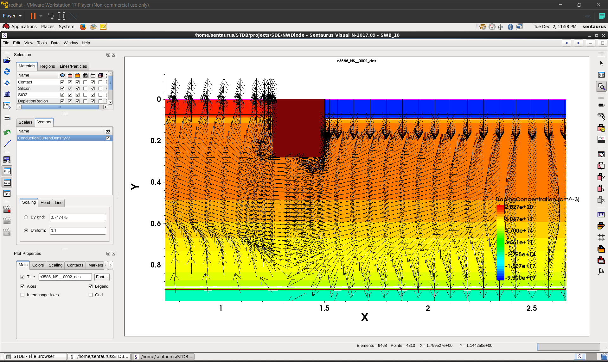

# 01 · Process simulation — N-well diode

Output from the `sprocess` N-well diode flow, viewed in Sentaurus Visual. The diode is the
simplest complete process flow in the Advanced material — well implant, anneal, contacts — which
makes it the right place to learn what process-simulation output looks like before tackling a
thirty-step CMOS flow.

Background: [`../../docs/06-process-simulation.md`](../../docs/06-process-simulation.md)

---

## Current density across a node array

`nwell-diode-current-density-node-array.png` · captured 23 November 2025

Several nodes of the N-well diode split laid out side by side in a single Sentaurus Visual
session, each showing current density in the structure.

The reason for arranging them this way rather than opening one plot at a time is that a process
split is a *comparison*, and a comparison you have to hold in your memory is not one you can
reason about. With the nodes tiled, the effect of the process variation on where and how
strongly current flows is legible at a glance. This is the view I would use to decide which
nodes are worth looking at in detail.

Node numbers are visible in the individual plot titles, which is how each panel traces back to
its point in the split tree.

---

## Current density as a vector field

`nwell-diode-current-density-vector-field.png` · captured 2 December 2025

The same structure with current density rendered as a **vector field** — arrows carrying
direction as well as magnitude — instead of a filled contour.

This is a different question, not a prettier answer. A magnitude contour tells you *how much*
current density there is at each point; a vector field tells you *where the current goes*. For a
diode with a well, a substrate and separate contacts, the conduction path is the interesting
part: whether current crosses the junction where you expect, how it spreads laterally in the
well, and where it collects at the contact. That is a question about direction, and only a
vector plot answers it.

Choosing the representation to match the question is a small skill and it is most of what makes
post-processing useful rather than decorative.
