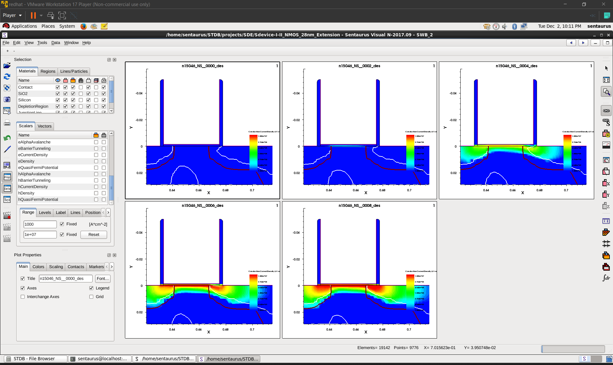

# 03 · Device simulation — fields under bias

Four captures from the evening of 2 December 2025, in the order I worked through them. Read as a
sequence they are a single piece of analysis rather than four screenshots: locate the physics
with field plots, make the panels comparable, look at the complementary quantity, then measure
it with a cutline.

Background: [`../../docs/07-structure-device-and-meshing.md`](../../docs/07-structure-device-and-meshing.md)

---

## 1 · Electron density across a gate-bias sweep

`nmos-28nm-edensity-gate-bias-sweep.png` · 19:39

Electron density in the 28 nm NMOS at several points in a gate-voltage sweep, tiled so the
progression is visible in one view.

This is a MOSFET turning on, seen directly. At low gate voltage the channel region is depleted
and there is no conducting path between source and drain. As the gate voltage passes threshold, a
dense sheet of electrons appears at the oxide interface and connects them. Every textbook says
inversion layer; this is what one looks like, and where it is — pressed against the interface, not
distributed through the bulk.

---

## 2 · The same sweep with the colour range pinned

`nmos-28nm-edensity-fixed-colour-range.png` · 19:39, immediately after the previous capture

The same data with the colour scale **fixed across all panels** instead of auto-scaled per panel.

This is the most methodologically important image in the folder, and the timestamp tells the
story: it was taken moments after the one above, because I had just realised the first comparison
was not a comparison.

Sentaurus Visual auto-scales each plot to its own data range by default. That means every panel in
a bias sweep is normalised to *its own* maximum, so every panel looks roughly the same — the
inversion layer appears equally intense at every gate voltage, and the quantity you are trying to
compare has been divided out. The plots are individually correct and collectively meaningless.
Pinning the range restores the actual comparison: now the panels differ because the physics
differs.

This trap is not specific to TCAD; it is a general hazard whenever a plotting tool helpfully
normalises. Worth being caught by once, and worth documenting.

---

## 3 · Conduction current density over the same sweep

`nmos-28nm-conduction-current-density-sweep.png` · 19:41

Conduction current density across the same gate-bias sweep.

The complement to the carrier-density view: electron density shows where the carriers *are*,
current density shows where they are *going*. In the on-state the current is confined to the thin
channel at the interface, which is the visual statement of why interface quality and surface
mobility degradation matter so much in a MOSFET — essentially all of the current flows through a
few nanometres of silicon immediately beneath the oxide.

---

## 4 · Vertical cutline, logarithmic scale

`nmos-28nm-edensity-vertical-cutline-log.png` · 19:55

A vertical cutline through the device, plotting electron density against depth on a logarithmic
axis, with several bias conditions overlaid.

Field plots locate things; cutlines measure them. A colour map cannot show five orders of
magnitude, so the fall-off from the inversion peak into the depletion region and down to the bulk
level is invisible in a 2D plot no matter how it is scaled. On a log axis it is all readable at
once: the peak density, its depth below the oxide interface, the decay through the depletion
region, and the background bulk concentration.

The depth of the peak is the detail worth pointing at. It does not sit exactly at the interface —
it sits a couple of nanometres into the silicon, which is the quantum-confinement displacement the
`eQuantumPotential` model exists to capture, and the reason inversion capacitance comes out below
the ideal oxide value. See
[`../../docs/09-ac-transient-and-thermal.md`](../../docs/09-ac-transient-and-thermal.md).
